# Über mich

handle:         m0veax
bürgerlich:     "Patrick Kilter"
rufname:        Lutz

In meinem Berufsleben mache ich Sachen mit Softwareentwicklung und Corporate-Requirements

## Food Impressions

:::::::::::::: {.columns}
::: {.column width="36%"}
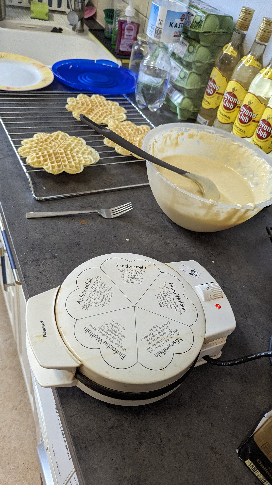
:::
::: {.column width="42%"}
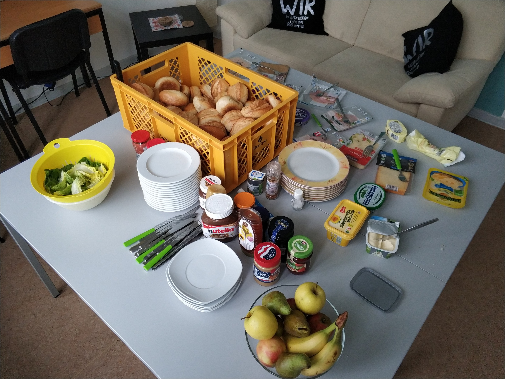
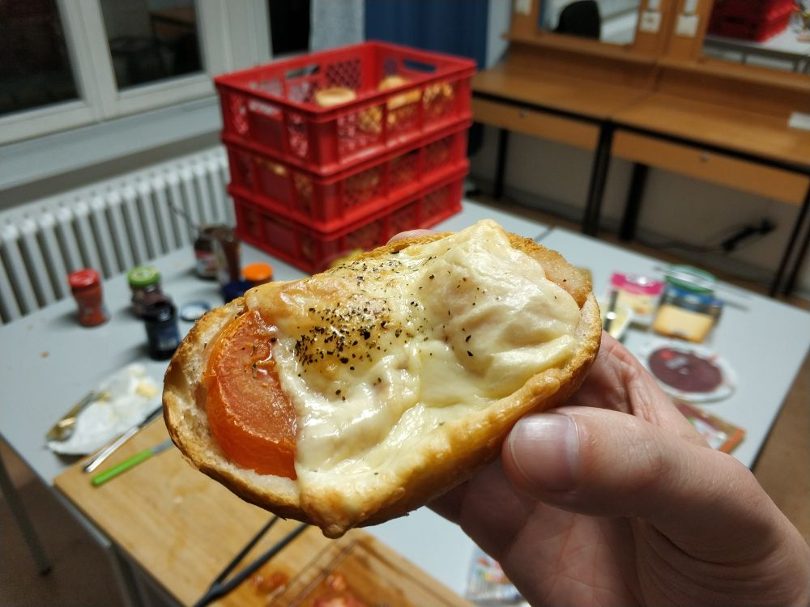
:::
::: {.column width="5%"}
:::
::::::::::::::

## Nutrition Stats

. . .

### Drinks

:::::::::::::: {.columns}
::: {.column width="45%"}
. . .

- Matekisten eingekauft: 15
- davon gebraucht: eher so 6
- fancy drinks: viel Auswahl
:::
::: {.column width="55%"}
. . .

- Saft: Apfelsaft weniger beliebt
- Kaffee + Tee: wurden getrunken
- Tschunk: verantwortungsvoll :-)
:::
::::::::::::::

. . .

### Food

:::::::::::::: {.columns}
::: {.column width="50%"}
- Mett gekauft am Freitag: 2kg

. . .

- davon gegessen: 2kg

. . .

- Mett bestellt für Samstag: 3kg

. . .

- davon bekommen: 2kg

. . .

- davon gegessen: 2kg

. . .

- Mettverbrauch gesamt: 4kg

. . .

:::
::: {.column width="50%"}
- Waffelverbrauch: viel

. . .

- Brötchenkauf am Freitag: 150

. . .

- Brötchenkauf am Samstag: 250

. . .

- Brötchenkauf am Sonntag: 100

. . .

- Schmandbrötchen: so einige

. . .

- Es war immer genug da. :D

:::
::::::::::::::

. . .

 \

Nächstes Mal mehr Mett und Schokoaufstrich? Gemüse und Obst?

## Workshop and Talk Impressions

:::::::::::::: {.columns}
::: {.column width="36%"}
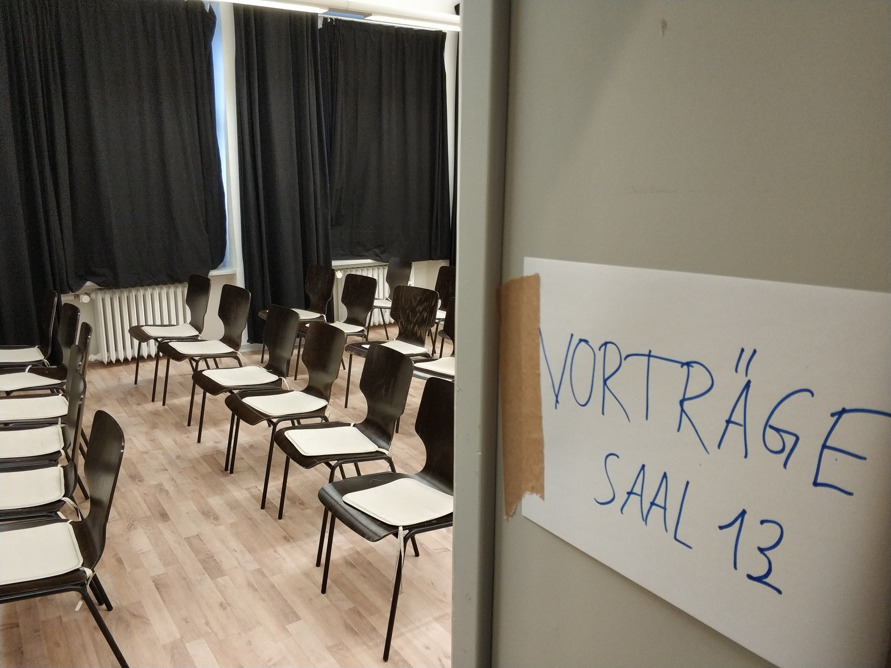
:::
::: {.column width="48%"}
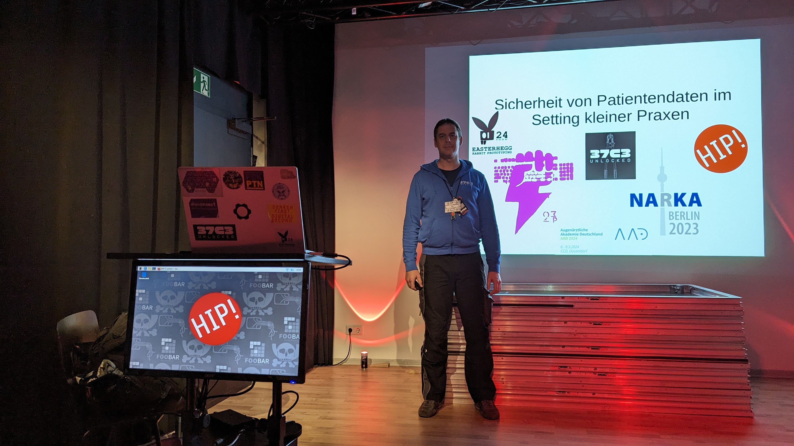
:::
::: {.column width="15%"}
:::
::::::::::::::

:::::::::::::: {.columns}
::: {.column width="42%"}
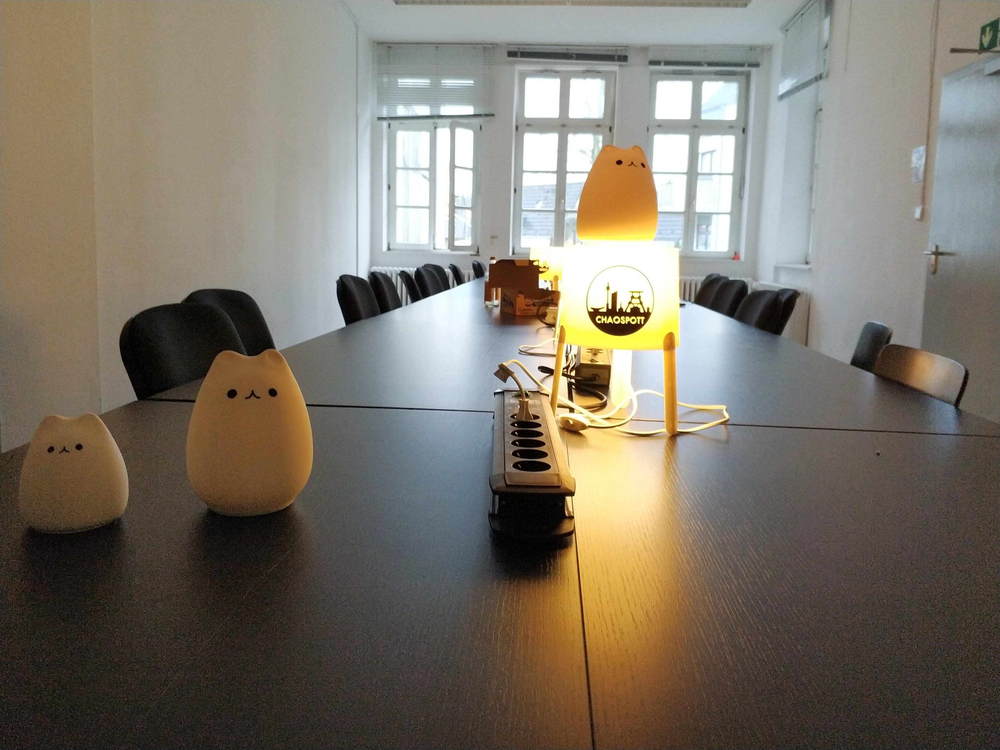
:::
::: {.column width="42%"}
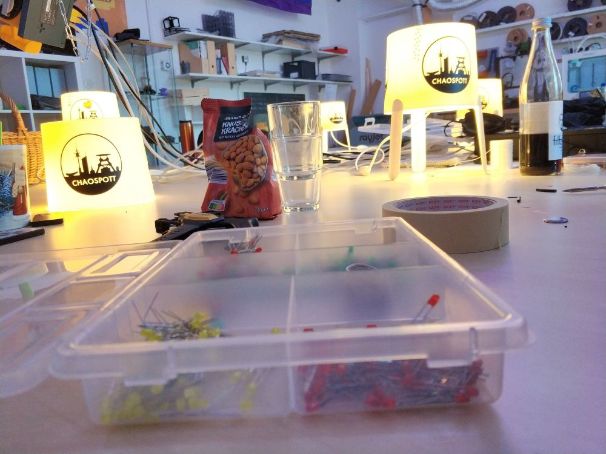
:::
::: {.column width="5%"}
:::
::::::::::::::

## Fahrplan

8 Vorträge, 8 Workshops, 3fach Unterhaltung

### Cat ears, anyone?

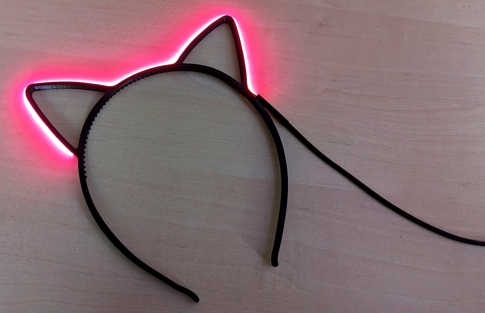{ height=60% }

## Danke

. . .

... an Freifunk Neanderland und das WIR-Haus für die super Location!

. . .

... an alle helfenden Hände für die durchgehende Unterstützung!

. . .

... an die Küche für die stete Versorgung mit Waffeln!

. . .

... an alle, die vorgetragen und Workshops gegeben haben!

. . .

... an euch alle, die ihr da wart und mit uns gehackt habt!

. . .

... an alle, die noch etwas von den übrigen Lebensmitteln mitnehmen!

. . .

... an alle, die jetzt beim Abbau und reinigen helfen. ;)

# Danke an alle!

## Feedback

Wie war es? Hat es euch gefallen?

Schreibt es uns an: <feedback@hackimpott.de>

. . .

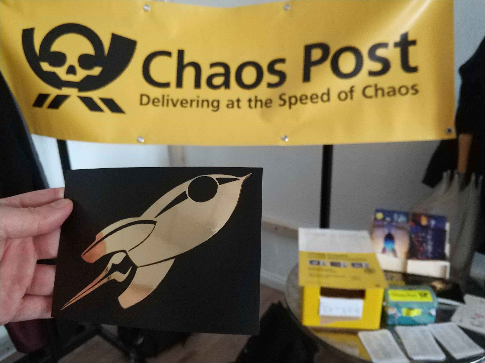{ width=45% } 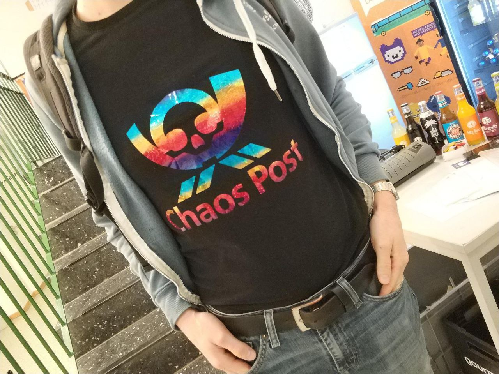{ width=45% }

... oder auch gern per Chaospost!

## Kommt gut wieder heim! :)

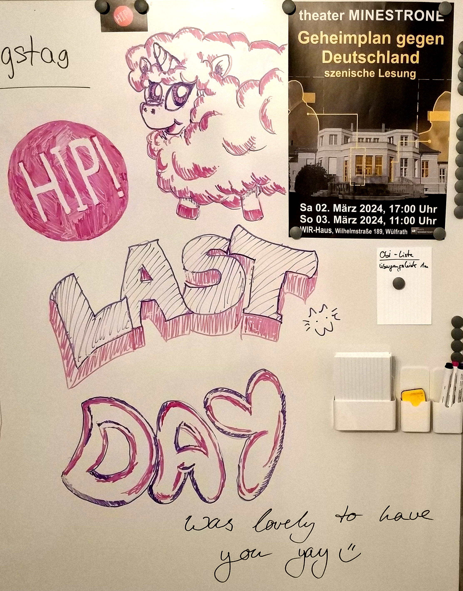{ height=70% }
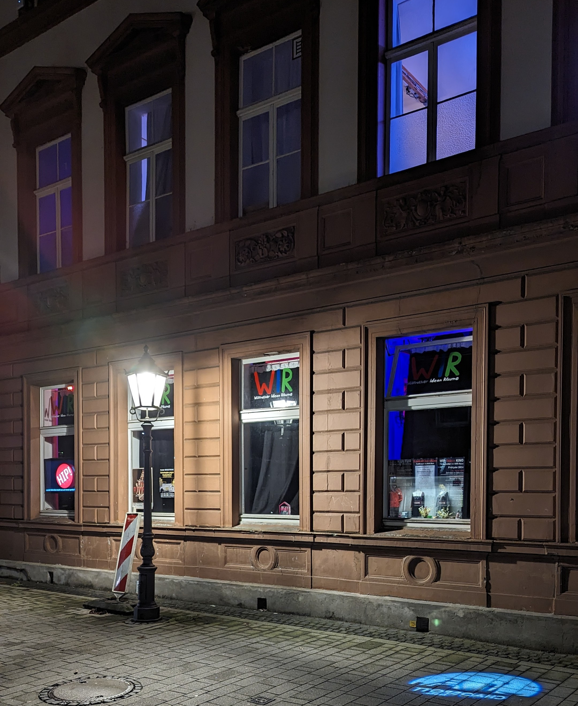{ height=70% }
